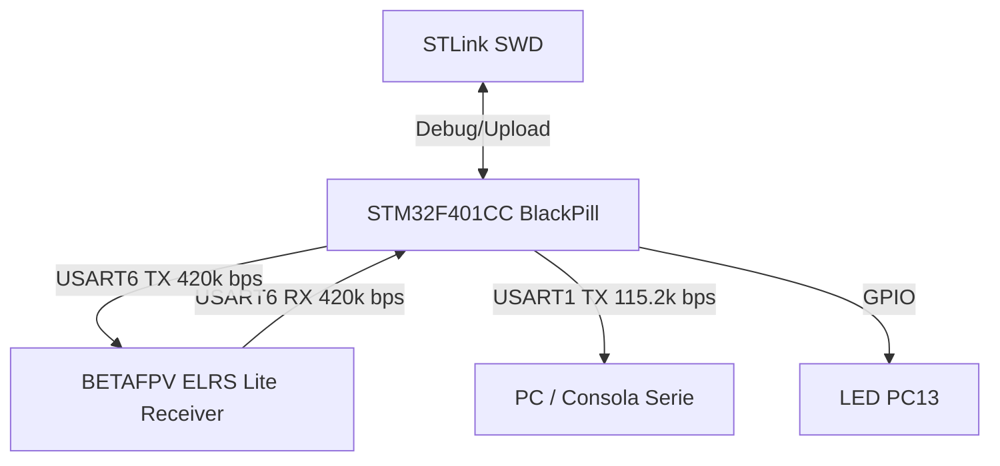

# Hardware

## Microcontrolador

| Característica | Detalle |
|---------------|---------|
| **Modelo** | STM32F401CCU6 (BlackPill) |
| **Arquitectura** | ARM Cortex-M4 (FPU) |
| **Frecuencia** | 84 MHz (PLL desde HSE 25 MHz) |
| **Flash** | 256 KB |
| **RAM** | 64 KB |
| **Framework** | LibOpenCM3 |
| **Entorno** | PlatformIO |
| **Debug** | STLink (SWD) + OpenOCD |

El sistema de reloj se configura en [`setup.c:3-15`](../src/setup.c#L3-L15) usando
`rcc_hse_25mhz_3v3[RCC_CLOCK_3V3_84MHZ]`. El DWT cycle counter se habilita para
los delays de microsegundos.

## Pines y Conectividad

| Pin | Periférico | AF | Dirección | Función |
|-----|-----------|----|-----------|---------|
| **PA9** | USART1 TX | AF7 | Output | Consola serie (115 200 bps) |
| **PA10** | USART1 RX | AF7 | Input | Consola serie (opcional) |
| **PA11** | USART6 TX | AF8 | Output | CRSF → RX del receptor ELRS |
| **PA12** | USART6 RX | AF8 | Input (pull-up) | CRSF ← TX del receptor ELRS |
| **PC13** | GPIO | — | Output | LED de heartbeat |

La configuración GPIO se realiza en [`setup.c:64-73`](../src/setup.c#L64-L73).
PA11/PA12 usan pull-up interno para mantener la línea en idle alto cuando el
receptor no está conectado.

## USART

### USART1 — Consola Serie

| Parámetro | Valor |
|-----------|-------|
| **Baudrate** | 115 200 bps |
| **Data bits** | 8 |
| **Stop bits** | 1 |
| **Paridad** | Ninguna |
| **Control de flujo** | Ninguno |
| **Modo** | TX/RX |
| **Interrupción RX** | Habilitada (NVIC_USART1_IRQ) |

APB2 a 84 MHz → divisor de baudrate exacto (sin error de redondeo).

### USART6 — CRSF

| Parámetro | Valor |
|-----------|-------|
| **Baudrate** | 420 000 bps |
| **Data bits** | 8 |
| **Stop bits** | 1 |
| **Paridad** | Ninguna |
| **Control de flujo** | Ninguno |
| **Modo** | TX/RX |
| **Interrupción RX** | Habilitada (NVIC_USART6_IRQ) |

> **Nota**: 420 000 bps es una velocidad no estándar requerida por el protocolo
> CRSF de ExpressLRS. Con APB2 = 84 MHz el divisor es exactamente 200 → 0% de error.
> Muchos otros microcontroladores no pueden generar esta velocidad exacta.

## Alimentación

| Característica | Detalle |
|---------------|---------|
| **Alimentación MCU** | 5V vía USB (regulador onboard 3.3V) |
| **Alimentación receptor** | 5V desde la BlackPill |
| **Consumo típico** | ~50 mA (MCU + receptor ELRS Lite) |

## Reloj del Sistema

| Señal | Valor | Origen |
|-------|-------|--------|
| **HSE** | 25 MHz | Cristal externo |
| **SYSCLK** | 84 MHz | PLL desde HSE |
| **APB1** | 42 MHz | SYSCLK / 2 |
| **APB2** | 84 MHz | SYSCLK |
| **SysTick** | 1 kHz | SYSCLK / 84000 |

Configuración en [`setup.c:3-8`](../src/setup.c#L3-L8) y
[`config.h:7-9`](../include/config.h#L7-L9).

## Diagrama de Bloques

---
*Documento generado el 2026-06-27. Ver también [Arquitectura Software](02-software-architecture.md), [Comunicaciones](03-communications.md).*
