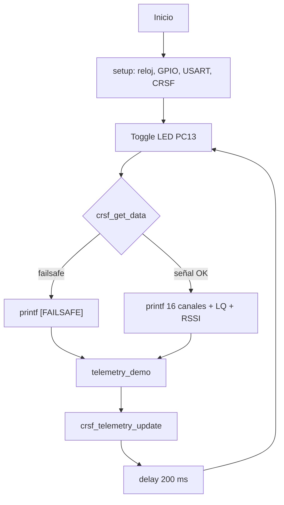
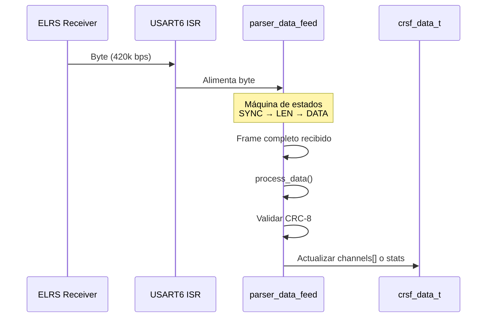
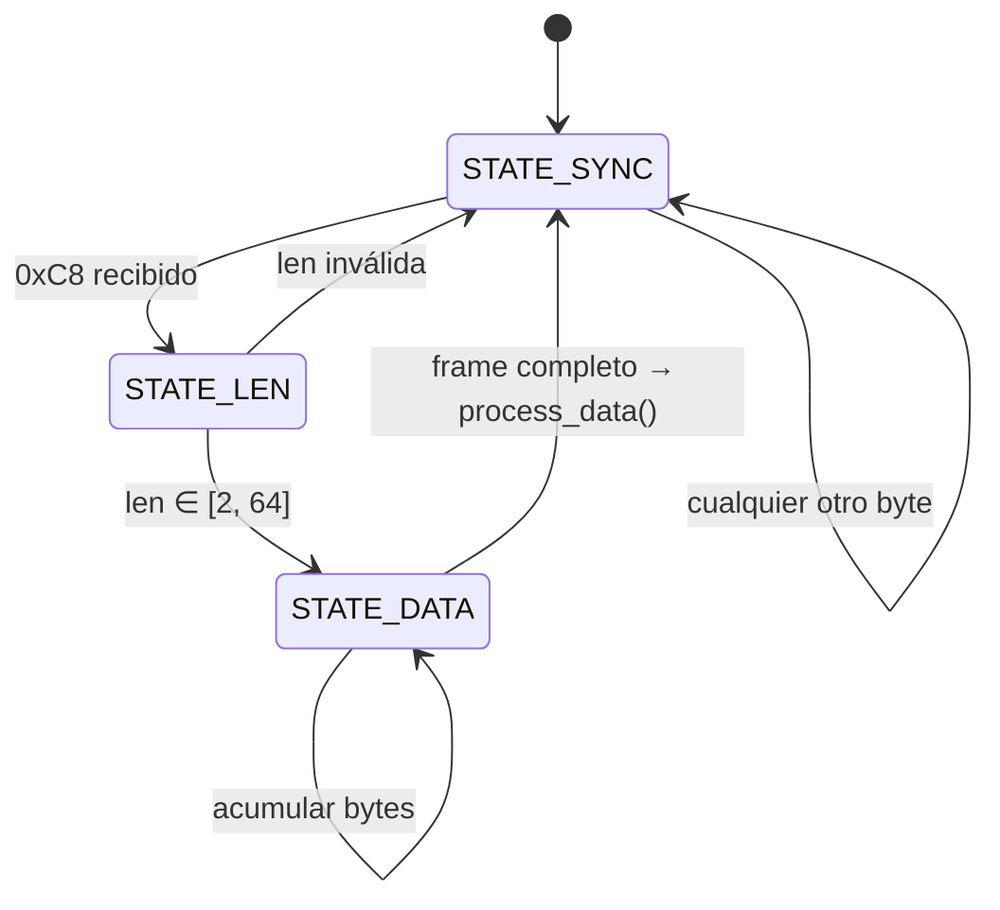

# Arquitectura Software

## Visión General

El firmware sigue una arquitectura dirigida por interrupciones con un bucle
principal de sondeo. La recepción CRSF es completamente asíncrona (ISR), mientras
que la salida de telemetría y la consola se manejan desde el bucle principal.

## Bucle Principal

El bucle en [`main.c:26-53`](../src/main.c#L26-L53) itera cada 200 ms:

1. **Toggle LED** — parpadeo de vida en PC13
2. **Leer datos CRSF** — `crsf_get_data()` evalúa failsafe y devuelve puntero a los últimos datos
3. **Imprimir consola** — vuelca los 16 canales RC + link quality + RSSI, o `[FAILSAFE]`
4. **Actualizar telemetría demo** — `telemetry_demo()` genera valores sintéticos
5. **Enviar telemetría** — `crsf_telemetry_update()` transmite un slot dirty si toca
6. **Delay 200 ms** — `delay(200)` usando el contador de SysTick

## Inicialización del Sistema

`setup()` en [`setup.c:75-82`](../src/setup.c#L75-L82) ejecuta en secuencia:

| Paso | Función | Acción |
|------|---------|--------|
| 1 | `setup_clock()` | HSE → PLL → 84 MHz, habilita relojes GPIOA/C, USART1/6, SYSCFG |
| 2 | `setup_systick()` | SysTick a 1 kHz, habilita interrupción |
| 3 | `setup_timer_priorities()` | Configura prioridades NVIC de SysTick, USART1, USART6 |
| 4 | `setup_gpio()` | LED PC13 output, USART1/6 en Alternate Function |
| 5 | `setup_usart()` | USART1 115200 8N1 TX/RX |
| 6 | `setup_usart_crsf()` | USART6 420000 8N1 TX/RX + RX interrupt + `crsf_init()` |

## ISRs y Prioridades

### Jerarquía de Interrupciones

| IRQ | Prioridad (NVIC) | Función | Contexto |
|-----|------------------|---------|----------|
| **SysTick** | 16×1 (baja) | `clock_tick()` — incrementa `clock_ticks` | [`delay.c:5-7`](../src/delay.c#L5-L7) |
| **USART1** | 16×2 (media) | No implementada (habilitada pero sin handler explícito) | — |
| **USART6** | 16×4 (alta) | `parser_data_feed(byte)` — alimenta el parser CRSF | [`setup.c:55-61`](../src/setup.c#L55-L61) |

> **⚠️ Importante**: USART6 tiene la prioridad más alta porque el parser CRSF
> debe procesar cada byte antes de que llegue el siguiente. A 420 000 bps, el
> intervalo entre bytes es de ~23.8 µs. La ISR debe completar en menos de ese
> tiempo. USART1 tiene prioridad más baja porque la consola es menos crítica
> y a 115 200 bps hay ~86.8 µs entre bytes.

### Flujo de Recepción CRSF

## Máquina de Estados del Parser CRSF

El parser en [`crsf_rx.c:89-115`](../src/crsf_rx.c#L89-L115) implementa una
máquina de 3 estados:

## Gestión de Tiempo

| Componente | Mecanismo | Resolución | Uso |
|-----------|-----------|------------|-----|
| **SysTick** | `systick_set_frequency(1000, 84MHz)` | 1 ms | `delay()`, `get_clock_ticks()` |
| **DWT Cycle Counter** | `dwt_enable_cycle_counter()` | 1/84 MHz ≈ 11.9 ns | `delay_us()`, `get_us_counter()` |

`clock_ticks` se usa como base de tiempo tanto para delays como para el timeout
de failsafe (500 ms sin trama RC).

---
*Documento generado el 2026-06-27. Ver también [Hardware](01-hardware.md), [Comunicaciones](03-communications.md), [Debug](04-debug-system.md).*
