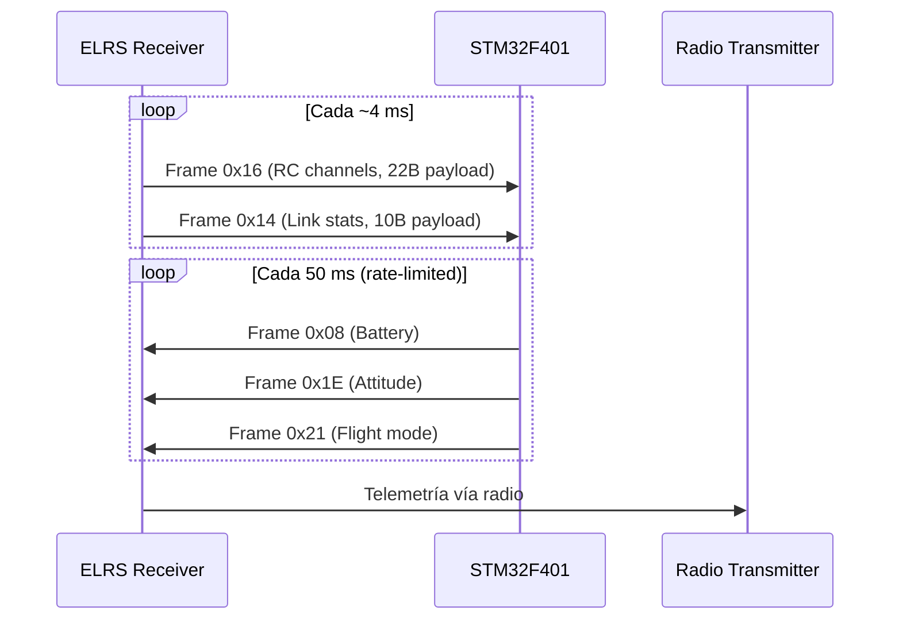

# Comunicaciones

## Interfaces

| Interfaz | Periférico | Velocidad | Dirección | Propósito |
|----------|-----------|-----------|-----------|-----------|
| **CRSF RX** | USART6 | 420 000 bps | ELRS → MCU | Canales RC + estadísticas de enlace |
| **CRSF TX** | USART6 | 420 000 bps | MCU → ELRS | Telemetría a la emisora |
| **Consola** | USART1 | 115 200 bps | MCU → PC | Salida de debug en tiempo real |

USART6 opera en modo TX/RX bidireccional (half-duplex a nivel lógico, aunque
el hardware soporta full-duplex). El protocolo CRSF es asimétrico: el receptor
envía tramas RC y link stats, el MCU envía tramas de telemetría.

---

## Protocolo CRSF (CrossFire Serial Protocol)

CRSF es el protocolo serie usado por los receptores ExpressLRS (ELRS) y TBS
CrossFire. Opera sobre UART a 420 000 bps con tramas delimitadas por un byte
de sincronización y protegidas por CRC-8.

### Formato de Trama

```
[SYNC 0xC8][LEN][TYPE][PAYLOAD…][CRC-8 DVB-S2]
```

| Campo | Bytes | Descripción |
|-------|-------|-------------|
| **SYNC** | 1 | Byte `0xC8`, delimita el inicio de trama |
| **LEN** | 1 | Longitud de TYPE + PAYLOAD + CRC (rango 2–64) |
| **TYPE** | 1 | Identificador del tipo de trama |
| **PAYLOAD** | N | Datos, formato dependiente de TYPE |
| **CRC** | 1 | CRC-8 DVB-S2 sobre TYPE + PAYLOAD |

El CRC-8 usa el polinomio `0xD5` (DVB-S2) calculado byte a byte en
[`utils.c:3-17`](../src/utils.c#L3-L17).



---

## Recepción CRSF (RX)

### Tipos de Trama Recibidos

| TYPE | Nombre | Payload | Descripción |
|------|--------|---------|-------------|
| `0x16` | RC Channels | 22 bytes | 16 canales × 11 bits, little-endian |
| `0x14` | Link Statistics | 10 bytes | RSSI, Link Quality, SNR, modo RF, potencia TX |

Implementado en [`crsf_rx.c:65-79`](../src/crsf_rx.c#L65-L79)
con las funciones auxiliares `parse_channels()` y `parse_stats()`.

### Decodificación de Canales RC

Cada canal ocupa 11 bits en little-endian (rango 172–1811):

| Valor | Pulso equivalente |
|-------|-------------------|
| **172** | ~1000 µs (mínimo) |
| **992** | ~1500 µs (centro) |
| **1811** | ~2000 µs (máximo) |

La extracción se realiza con máscaras y desplazamientos en
[`crsf_rx.c:27-44`](../src/crsf_rx.c#L27-L44). Los 16 canales se empaquetan
en 22 bytes (16 × 11 bits = 176 bits = 22 bytes exactos).

### Estadísticas de Enlace

| Campo | Byte | Tipo | Rango |
|-------|------|------|-------|
| **RSSI** | payload[0] | uint8 → int8 (negado) | 0 a -127 dBm |
| **Link Quality** | payload[2] | uint8 | 0–100 % |
| **SNR** | payload[3] | int8 | -128 a 127 dB |

Mapeo en [`crsf_rx.c:46-50`](../src/crsf_rx.c#L46-L50).

### Estructura de Datos

```c
typedef struct {
    uint16_t channels[16];  // 172–1811 (~1000–2000 µs)
    uint8_t link_quality;   // 0–100 %
    int8_t signal_strength; // RSSI en dBm (negativo)
    int8_t signal_to_noise; // SNR en dB
    bool failsafe;          // true si no hay trama RC en > 500 ms
} crsf_data_t;
```

Definido en [`crsf_rx.h:20-26`](../include/crsf_rx.h#L20-L26).

### Detección de Failsafe

`crsf_get_data()` en [`crsf_rx.c:117-121`](../src/crsf_rx.c#L117-L121)
compara `clock_ticks - last_data_ms > 500`. Si han pasado más de 500 ms desde
la última trama RC válida, se activa el flag `failsafe`.

> **⚠️ Advertencia**: `crsf_get_data()` devuelve un puntero a datos volátiles
> que la ISR puede modificar concurrentemente. No es segura para usar desde
> otra ISR ni desde el bucle principal sin protección. Ver
> [SW-02](05-known-issues.md#sw-02).

---

## Transmisión CRSF (TX) — Telemetría

### Tipos de Trama Transmitidos

| TYPE | Nombre | Payload | Sensores EdgeTX |
|------|--------|---------|-----------------|
| `0x08` | Battery | 8 bytes | RxBt, Curr, Capa, Bat% |
| `0x1E` | Attitude | 6 bytes | Ptch, Roll, Yaw |
| `0x21` | Flight Mode | ≤ 16 bytes | FM |
| `0x09` | Baro | 4 bytes | Alt, VSpd |
| `0x02` | GPS | 15 bytes | GPS, GSpd, Hdg, Alt, Sat |

Implementado en [`crsf_tx.c`](../src/crsf_tx.c).

### Sistema Dirty + Round-Robin

Cada llamada a un setter marca el slot correspondiente como *dirty*.
`crsf_telemetry_update()` recorre los 5 slots en round-robin buscando el
siguiente dirty, con un intervalo mínimo de 50 ms entre tramas:

| Índice | Slot | Setter |
|--------|------|--------|
| 0 | Battery | `crsf_telemetry_set_battery(voltage, current, capacity, pct)` |
| 1 | Attitude | `crsf_telemetry_set_attitude(pitch, roll, yaw)` |
| 2 | Flight Mode | `crsf_telemetry_set_flight_mode("MODE")` |
| 3 | Baro | `crsf_telemetry_set_baro(altitude_cm, vspeed_cms)` |
| 4 | GPS | `crsf_telemetry_set_gps(lat, lon, speed, heading, alt, sats)` |

Solo los slots actualizados generan tráfico. Los slots nunca modificados no
consumen ancho de banda.

### API de Telemetría

| Función | Parámetros |
|---------|-----------|
| `crsf_telemetry_set_battery()` | `voltage_mv` (uint16), `current_ma` (uint16), `capacity_mah` (uint24), `remaining_pct` (uint8) |
| `crsf_telemetry_set_attitude()` | `pitch`, `roll`, `yaw` (int16 × 0.0001 rad) |
| `crsf_telemetry_set_flight_mode()` | `mode_str` (ASCII, ≤ 15 chars + `\0`) |
| `crsf_telemetry_set_baro()` | `altitude_cm` (int32), `vspeed_cms` (int16) |
| `crsf_telemetry_set_gps()` | `lat/lon` (int32 × 1e7), `speed` (× 10 km/h), `heading` (× 100°), `altitude` (m), `sats` |
| `crsf_telemetry_update()` | Sin parámetros; llamar en cada iteración del bucle principal |

### Demo de Telemetría

`telemetry_demo()` en [`main.c:11-24`](../src/main.c#L11-L24) genera valores
sintéticos que varían con el tiempo:

- **Batería**: voltaje oscilando 12.0–14.8 V, corriente variable, capacidad creciente
- **Actitud**: pitch/yaw cíclicos, roll con rampa
- **Flight mode**: rota entre IDLE → ARMED → SPINNING → BRAKING cada 4 s
- **Baro y GPS**: comentados en el código

---

## Gestión de Errores

| Error | Detección | Recuperación |
|-------|-----------|--------------|
| **CRC inválido** | CRC-8 DVB-S2 | Descartar trama silenciosamente |
| **Byte de sync perdido** | Estado SYNC busca 0xC8 | Resync automático |
| **Longitud inválida** | LEN < 2 o LEN > 64 | Volver a SYNC |
| **Failsafe** | Timeout 500 ms sin trama RC | Flag `failsafe = true` |
| **Datos parciales** | Fin de trama esperado por longitud | Ver [CM-01](05-known-issues.md#cm-01) |

---
*Documento generado el 2026-06-27. Ver también [Hardware](01-hardware.md), [Arquitectura Software](02-software-architecture.md), [Debug](04-debug-system.md).*
